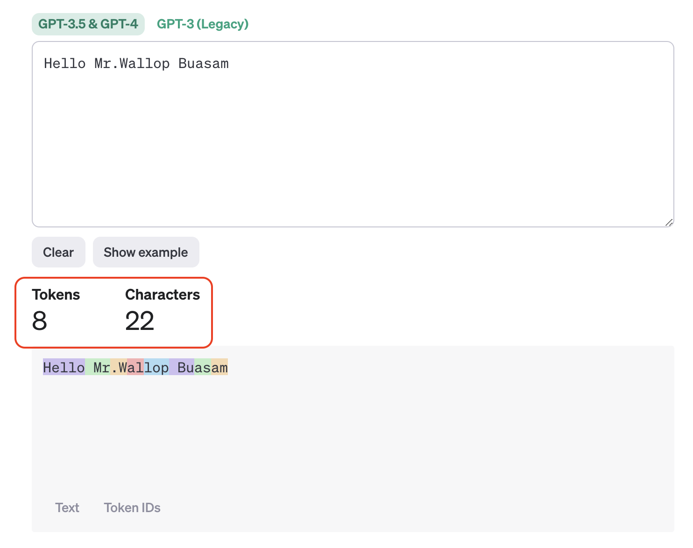
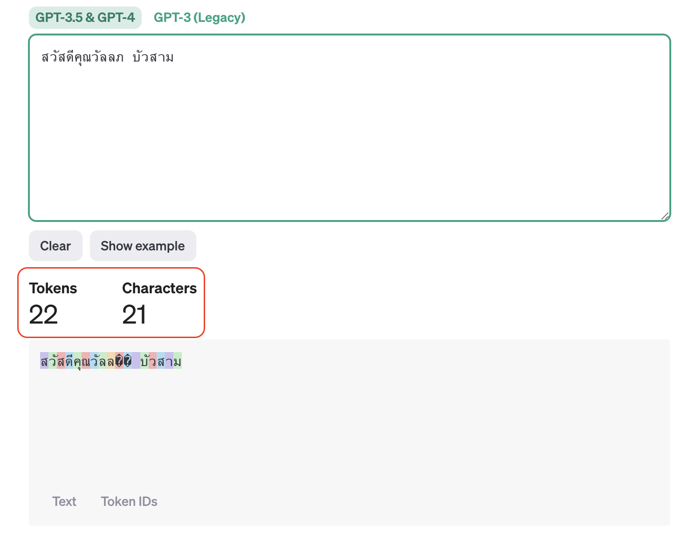
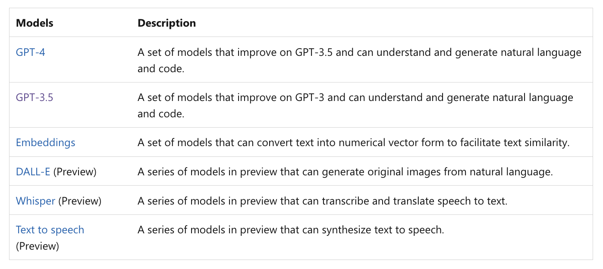
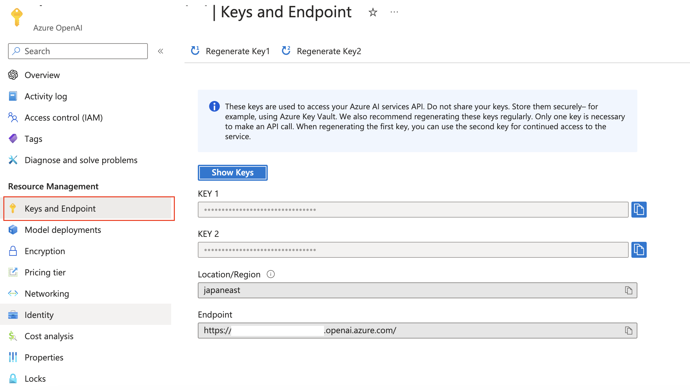
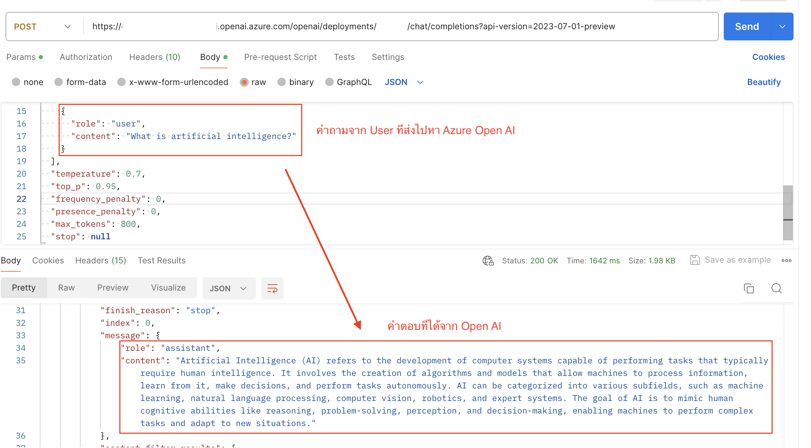

# มาเรียนรู้ Azure Open AI แบบ Step by Step กันครับ

[](https://github.com/codespaces/new?hide_repo_select=true&ref=main&repo=599293758&machine=standardLinux32gb&devcontainer_path=.devcontainer%2Fdevcontainer.json&location=WestUs2)

## Overview

ตอนนี้วงการ IT มีการพูดถึงตัว ChatGPT และ Open AI กันมาก โดยส่วนใหญ่หลังจากมีการเปิดตัว LLM หลายคนได้ลองสมัครเล่นไปบ้างแล้วนั้น 

บางคนเกิดความคิดและไอเดียต่างๆที่อยากนำเจ้า Open AI มาประยุกต์ใช้ในองค์กรให้เกิดประโยชน์ต่อไป แต่ก็ยังมีหลายคำถามที่ยังคงกังวลไม่ว่าจะเป็นเรื่องของ Data Privacy, Security รวมถึง Responsible AI ที่เข้ามาเกี่ยวข้องในการนำมาใช้อย่างหลีกเลี่ยงไม่ได้

แต่ในมุมของ Microsoft เองที่ได้มีส่วนร่วมในการพัฒนาตัว LLM มาตั้งแต่ต้นนั้น ได้มีการออกมาชี้แจงในหลายๆคำถาม ซึ่งสามารถเข้าไปศึกษาเพิ่มเติมได้จาก [Responsible AI principles from Microsoft](https://www.microsoft.com/en-us/ai/responsible-ai?activetab=pivot1%3aprimaryr6) ซึ่งสามารถตอบคำถามที่คลายกังวลให้กับหลายๆท่านได้อย่างดี

>ส่วนตัวอย่างนี้จะเป็นการเริ่มต้นติดตั้ง Service Azure Open AI บน Microsoft Azure แบบ Step by Step รวมถึงยกตัวอย่าง (Use case) ในการนำมาประยุกต์ใช้เพื่อช่วยเพิ่มประสิทธิภาพในการทำงานให้ดีขึ้นและรวมเร็วรวมถึงเป็นแนวทางในการพัฒนา Application ต่อไป.

### Key concepts

**Prompts & completions** ใช่แล้วครับ หากทุกคนเคยใช้ ChatGPT จะพอทราบเรื่องของการใช้งาน Prompt มาเบื้องต้นแล้ว ส่วน Completion ถ้าเอาตามความเข้าใจง่ายๆมันก็คือ สิ่งที่ตัว Open AI ตอบกลับมาหลังจากเราทำการส่ง Prompt ไปแล้วนั่นเอง ซึ่งทั้งการส่ง Prompt และการรับค่า Completion มานั้นเราจะมีการคำนวณเรื่องปริมาณตัวอักษรที่ถูกใช้ โดยจะเรียกค่าตรงนี้เป็นจำนวน **Token** 

###  Token

เราสามารถคำนวณจำนวน Token ในการใช้งานได้จากเว็บ [Tokenizer](https://platform.openai.com/tokenizer) ของ Open AI .com ได้เลยครับ

***Remark: การคิดจำนวณ Token ในภาษาไทยจะมากกว่าภาษาอังกฤษประมาณ 2-3 เท่า***
 ดูได้จากตัวอย่างการคิดจากภาพประกอบดังนี้ครับ

ตัวอย่างภาษาอังกฤษที่จำนวน Charactor ใกล้เคียงกัน



ตัวอย่างภาษาภาษาไทยที่จำนวน Charactor ใกล้เคียงกัน



***สังเกตุได้ว่าจำนวน Token จะแตกต่างกัน ให้ระวังในการนำไปประเมินการใช้งาน
เนื่องจากจะมีผลกับการออกแบบระบบของเราหลายจุด เช่น***

- การเลือก Model ที่จะนำมาใช้ซึ่งในแต่ละ Model จะ Support Maximum Token ที่แตกต่างกัน (ex. 4k, 16k)
- การ Config เกี่ยวกับ Quota ของการใช้งาน หน่วยเป็น TPM (Token Per Minutes)

###  Azure Open AI Model

ในส่วนของ Model บน Azure Open AI จะมีให้เลือกใช้หลายตัว สามารถเข้าไปศึกษาเพิ่มเติมได้จาก Link  [Azure Open AI Models](https://learn.microsoft.com/en-us/azure/ai-services/openai/concepts/models) โดยในตัวอย่างนี้จะใช้เป็น GPT-3.5 โดยปัจจุบันจะมีให้เลือกเป็น 4k หรือ 16k ซึ่งจะแตกต่างกันในมุมการนำไปใช้และค่าใช้จ่ายในการคิด Token ครับ


#####

#
## Getting Started

> **ส่วนสำคัญ:** 
เพื่อให้สามารถใช้งานตัวอย่างนี้ได้ คุณจำเป็นต้องมี การสมัครสมาชิก Azure และเปิดใช้งานบริการ Azure OpenAI คุณสามารถขอเข้าถึงได้ ที่นี่ [Request Access Azure Open AI](https://aka.ms/oaiapply) นอกจากนี้ คุณยังสามารถรับเครดิต Azure ฟรีเพื่อเริ่มต้นได้ ที่นี่ [Azure Free Credit](https://azure.microsoft.com/free/cognitive-search/)


> **AZURE RESOURCE COSTS** จากตัวอย่างจะมีการใช้งาน Azure Credit ในการคิดค่า Token ต่อการส่งและรับ โดยท่านสามารถศึกษาเพิ่มเติมได้จาก [Azure Open AI Pricing](https://azure.microsoft.com/en-us/pricing/details/cognitive-services/openai-service/)

#
## Prerequisites

#### Azure Open AI Service
- Endpoint 
>https://{openairesourcename}.openai.azure.com/openai/deployments/{modelname}/chat/completions?api-version=2023-07-01-preview  

- API Key (ดูได้จากรูปภาพ)

- JSON payload (ตัวอย่างตามข้อมูลด้านล่างนี้)
```
{
  "messages": [
    {
      "role": "system",
      "content": "The system is an AI teacher that helps people learn about AI"
    },
    {
      "role": "user",
      "content": "What are different types of artificial intelligence?"
    },
    {
      "role": "assistant",
      "content": "There are three main types of artificial intelligence: Narrow or Weak AI (such as virtual assistants like Siri or Alexa, image recognition software, and spam filters), General or Strong AI (AI designed to be as intelligent as a human being. This type of AI does not currently exist and is purely theoretical), and Artificial Superintelligence (AI that is more intelligent than any human being and can perform tasks that are beyond human comprehension. This type of AI is also purely theoretical and has not yet been developed)."
    },
    {
      "role": "user",
      "content": "What is artificial intelligence?"
    }
  ],
  "temperature": 0.7,
  "top_p": 0.95,
  "frequency_penalty": 0,
  "presence_penalty": 0,
  "max_tokens": 800,
  "stop": null
}
```
- โปรแกรม Postman สำหรับทดสอบการ Call API สามารถดาวน์โหลดได้ที่ [Download Postman](https://www.postman.com/downloads/)

#

### How to Test Azure Open AI
หลังจากที่เราได้ Provisioning Service Azure Open AI เรียบร้อยแล้ว ให้เราจำลองการใช้งานด้วยการ Call API ผ่าน Tool POSTMAN ได้จากตัวอย่างตามภาพ



#